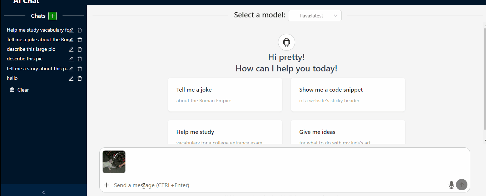

# AI Chat UI
Start from Ollama, to build a simple chat UI.

## Demo

## Features
- Chats in streaming manner
- Chat history by IndexedDB in browser
- Chat with both text and image (Image need to be supported by your LLM, like `Llava`)
- Cancel the generation request
- Edit last request message
- Regenerate the last response
- Choose a PDF file, then extract text or capture as images.
### TODO
- To support options.

## Tech stack:
- Ollama
- React.js with Ant Design
- Backend by Spring Boot Webflux (https://github.com/ShanGor/react-gateway/tree/feature/ai-chat-backend)